[TOC]

# 简单明朗的 RNN 写诗教程

本来想做一个标题党的，取了一个**史上最简单的 RNN 写诗教程**这标题，但是后来想了想，这TM不就是标题党吗？怎么活成了自己最讨厌的模样？😒后来就改成了这个标题。

在上篇博客[网络流量预测入门（一）之RNN 介绍](https://www.cnblogs.com/xiaohuiduan/p/14324502.html)中，介绍了RNN的原理，而在这篇博客中，将介绍如何使用keras构建RNN，然后自动写诗。

项目地址：[Github：https://github.com/xiaohuiduan/rnn_chinese_poetry](https://github.com/xiaohuiduan/rnn_chinese_poetry)


## 数据集介绍

既然是写诗，当然得有数据集，不过还好有大神已经将数据集准备好了，具体数据集的来源已不可知，因为网上基本上都是使用这个数据集。*（如果有人知道，可以在评论区指出，然后我再添加上）*

数据集地址：[Github](https://github.com/xiaohuiduan/rnn_chinese_poetry/blob/main/data/poetry.txt)，数据集部分数据如下所示：

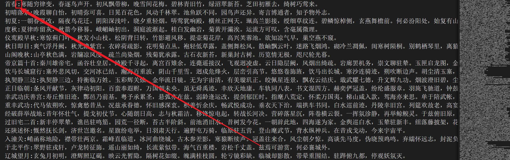

在数据集中，**每一行**都是一首唐诗，其中，诗的题目和内容以 **":"** 分开，每一首诗都有题目，但是不一定有内容（也就是说内容可能为空）。其中，诗内容中的标点符号都是**全角符号**。有一些诗五言诗，不过也有一些诗不是五言的。当然，我们只考虑**五言诗**（大概有27k首）。


## 代码思路

### 输入 and 输出

首先我们得先弄清我们要干什么，然后才能更好得写代码。如标题所示，目的是使用RNN写诗，那么必然有输入和输出。那么问题来了，RNN的输入是什么，输出是什么？

我们希望rnn能够写诗，那么怎么写呢？我们这样定义如下的方式：


RNN接受 **6个字符**（5个字+一个标点符号），然后输出下一个字符。至于怎么生成一首完整的诗词，等到后面讨论。

RNN当然不能够直接接受 "床前明月光，" 这个中文的输入，我们要对其进行 Encode，变成数字，然后才能够输入到RNN网络中。同理，RNN输出的肯定也不是一个中文字符，我们也要对其进行Decode 才能将输出变成一个中文字符。

怎么进行Encode，有一个很简单的方法，那就是进行**one-hot**编码，对于每一个字（包括标点符号在内）我们都进行onehot编码，这样就可以了。但实际上，这个这样会有一点小问题。在数据集中，所有符合条件的诗，大概由近 **7,000** 个字符组成，如果对每一个字都进行onehot编码的话，就会消耗大量的内存，同时也会加大计算的复杂度。

因此，我们定义如下：只对前出现频率最多的 **2999**  个字符进行 one-hot 编码，对于剩下的字，用 **“ ”**（空格字符）代替。这样一共只需要对3000个字符进行one-hot编码就🆗了（2999个字符+一个空格字符）。



### 训练集构建

在前面我们定义了RNN的输入和输出，同时也有诗的数据集， 那么我们构建**训练集**呢？参考[RNN模型与NLP应用(6/9)：Text Generation (自动文本生成)](https://www.youtube.com/watch?v=10cjvcrU_ZU&list=PLvOO0btloRnuTUGN4XqO85eKPeFSZsEqK&index=6&ab_channel=ShusenWang)

具体步骤如下图所示：我们将一句诗可以进行如下切分。然后将切分得到的数据进行one-hot编码，然后进行训练即可。（这样看来，每一首诗可以生成很多的数据集）

.svg)


### 生成一首完整的诗

前面我们讨论了关于网络的输入和输出，以及数据集的构建，那么，假如我们有一个已经训练好的模型，如何来产生一首诗的？

生成一首完整的诗的流程如下所示，与训练的操作有点类似，只不过会将RNN的输出重新当作RNN的输入。（以此来产生符合字数要求的诗）



经过上述的操作，大家实际上可以尝试的写一些代码了，基本上不会有很大的问题。接下来，我将讲一讲具体怎么实现。


## 代码实现

首先定义一些配置：

- DISALLOWED_WORDS：如果在诗中出现了**DISALLOWED_WORDS**，则舍弃这首诗。

```python
# 诗data的地址
poetry_data_path = "./data/poetry.txt"
# 如果诗词中出现这些词，则将诗舍弃
DISALLOWED_WORDS = ['（', '）', '(', ')', '__', '《', '》', '【', '】', '[', ']']
# 取3000个字作诗,其中包括空格字符
WORD_NUM = 3000
# 将出现少的字使用空格代替
UNKONW_CHAR = " "
# 根据前6个字预测下一个字，比如说根据“寒随穷律变，”预测“春”
TRAIN_NUM = 6
```


### 读取文件

针对于数据集，我们有如下的要求：

- 必须是**五言诗**（不过下面的代码无法完全保证是五言诗），同时至少要有**两句诗**
- 不能出现上文中定义的DISALLOWED_WORDS

前面我们说了，每一首诗必有题目和内容（内容可以为空），其中，题目和内容以 ":"（半角）分开，因此，我们可以通过 `line.split(":")[1]`获得诗的内容。

下述代码实现了两个功能：

1. 获得符合要求的诗：`(len(poetry)-1) % 6`，每一首五言诗，包括“，。”一共有$6*n$ 个字，同时每一首诗是以 "\n" 结尾的，因为我们``(len(poetry)-1)%6==0``则就代表符合要求。同时五言诗的第6个字符是"，"——> 使用`poetrys`保存。
2. 获得诗中出现的字符。——>使用`all_word`保存。

```python
# 保存诗词
poetrys = []
# 保存在诗词中出现的字
all_word = []

with open(poetry_data_path,encoding="utf-8") as f:
    for line in f:
        # 获得诗的内容
        poetry = line.split(":")[1].replace(" ","")
        flag = True
        # 如果在句子中出现'（', '）', '(', ')', '__', '《', '》', '【', '】', '[', ']'则舍弃
        for dis_word in DISALLOWED_WORDS:
            if dis_word in poetry:
                flag = False
                break

        # 只需要5言的诗（两句诗包括标点符号就是12个字），假如少于两句诗则舍弃
        if  len(poetry) < 12 or poetry[5] != '，' or (len(poetry)-1) % 6 != 0:
            flag = False

        if flag:
            # 统计出现的词
            for word in poetry:
                all_word.append(word)
            poetrys.append(poetry)
```

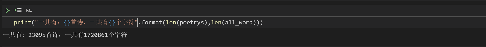


### 统计字数

前面我们说过，在数据集中，所有符合条件的诗，大概由近 **7,000** 个字组成，如果对每一个字都进行one-hot编码的话，就会浪费大量的内存，加大计算的复杂度。解决方法可以这样做：

> 使用Counter对字数进行统计，然后根据出现的次数进行排序，最后得到出现频率最多的2999个字。

```python
from collections import Counter
# 对字数进行统计
counter = Counter(all_word)
# 根据出现的次数，进行从大到小的排序
word_count = sorted(counter.items(),key=lambda x : -x[1])
most_num_word,_ = zip(*word_count)
# 取前2999个字，然后在最后加上" "
use_words = most_num_word[:WORD_NUM - 1] + (UNKONW_CHAR,)
```

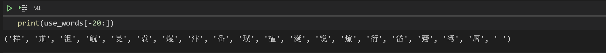


### 构建word 与 id的映射

我们需要对word进行onehot编码，怎么编呢？很简单，每一个word对应一个id，然后对这个id进行one-hot编码就行了。因此我们需要构建word到id的映射。

> 举个例子：如果一共只有3个字“唐”，“宋”，“明”，然后我们可以构建如下的映射：
>
> "唐" ——> 0 ；"宋"——>1；"明"——>2；进行one-hot编码后，则就变成了：
>
> - 唐：[1,0,0]
> - 宋：[0,1,0]
> - 明：[0,0,1]

构建word与id的映射是必须的，经过如下简单的代码，便构成了映射。

```python
# word 到 id的映射 {'，': 0,'。': 1,'\n': 2,'不': 3,'人': 4,'山': 5,……}
word_id_dict = {word:index for index,word in enumerate(use_words)}

# id 到 word的映射 {0: '，',1: '。',2: '\n',3: '不',4: '人',5: '山',……}
id_word_dict = {index:word for index,word in enumerate(use_words)}
```

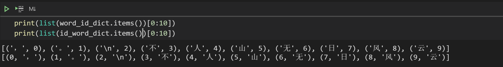


### 转成one-hot代码

下面定义两个函数：

- word_to_one_hot将一个字转成one-hot 形式

  

- phrase_to_one_hot 将一个句子转成one-hot形式

  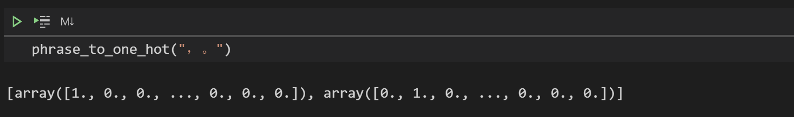

```python
import numpy as np
def word_to_one_hot(word):
    """将一个字转成onehot形式

    :param word: [一个字]
    :type word: [str]
    """
    one_hot_word = np.zeros(WORD_NUM)
    # 假如字是生僻字，则变成空格
    if word not in word_id_dict.keys():
        word = UNKONW_CHAR
    index = word_id_dict[word]
    one_hot_word[index] = 1
    return one_hot_word

def phrase_to_one_hot(phrase):
    """将一个句子转成onehot

    :param phrase: [一个句子]
    :type poetry: [str]
    """
    one_hot_phrase = []
    for word in phrase:
        one_hot_phrase.append(word_to_one_hot(word))
    return one_hot_phrase
```

### 随机打乱数据

```python
np.random.shuffle(poetrys)
```

### 构建训练集

然后我们需要进行如下操作，根据诗构建数据集(one-hot编码之前的数据集)。

.svg)

构建数据集的时候我们需要注意一件事情，需要区分不同的诗（因为我们总不可能用A的诗去预测B的诗噻，hhh）。每一首诗都是以 "\n" 结尾的，因此，当循环到"\n"时，就代表对于这首诗，我们已经构建好数据集了（上图中的X_Data【用`X_train_word`表示】，Y_Data【用`Y_train_word`表示】）。

```python
X_train_word = []
Y_train_word = []

for poetry in poetrys:
    for i in range(len(poetry)):
        X = poetry[i:i+TRAIN_NUM]
        Y = poetry[i+TRAIN_NUM]
        if "\n" not in X and "\n" not in Y:
            X_train_word.append(X)
            Y_train_word.append(Y)
        else:
            break
```

在没有打乱顺序的情况下，部分结果如下所示：


### 构建模型

使用的框架：

- keras：2.4.3：如果想使用我训练好的模型，请保持版本一致。如果自己训练的话，就无所谓了。

模型图如下所示，模型结构参考[Poems_generator_Keras](https://github.com/youyuge34/Poems_generator_Keras)，关于SimpleRNN的介绍可以参考[Keras-SimpleRNN](https://kldivergence.github.io/keras-docs-zh/layers/recurrent/#simplernn)，关于如何使用keras构建神经网络可以参考[数据挖掘入门系列教程（十一）之keras入门使用以及构建DNN网络识别MNIST](https://www.cnblogs.com/xiaohuiduan/p/12806241.html)。

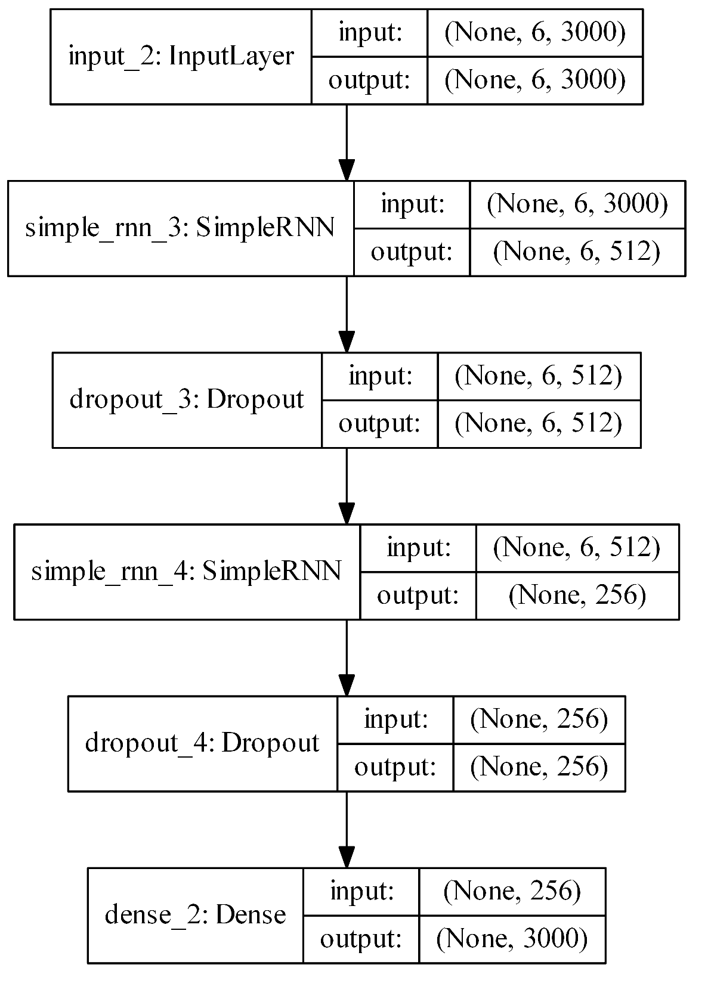

在前面说了，RNN模型输入的是一个 **6个字符** 的句子，因此经过one-hot编码后就会变成shape为(6,3000)的数组，而输出为**一个**字符，对应one-hot编码的shape为(3000)。


代码如下所示：

```python
import keras
from keras.callbacks import LambdaCallback,ModelCheckpoint
from keras.models import Input, Model
from keras.layers import  Dropout, Dense,SimpleRNN 
from keras.optimizers import Adam
from keras.utils import plot_model

def build_model():
    print('building model')
    # 输入的dimension
    input_tensor = Input(shape=(TRAIN_NUM,WORD_NUM))
    rnn = SimpleRNN(512,return_sequences=True)(input_tensor)
    dropout = Dropout(0.6)(rnn)

    rnn = SimpleRNN(256)(dropout)
    dropout = Dropout(0.6)(rnn)
    dense = Dense(WORD_NUM, activation='softmax')(dropout)

    model = Model(inputs=input_tensor, outputs=dense)
    optimizer = Adam(lr=0.001)
    model.compile(loss='categorical_crossentropy', optimizer=optimizer, metrics=['accuracy'])
    model.summary()
    # 画出模型图
    # plot_model(model, to_file='model.png', show_shapes=True, expand_nested=True, dpi=500)
    return  model
```

对于SimpleRNN，如果`return_sequences=True`，则代表其返回如下：

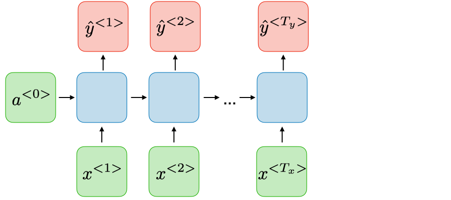

如果`return_sequences=False`(默认)，则代表返回如下所示：

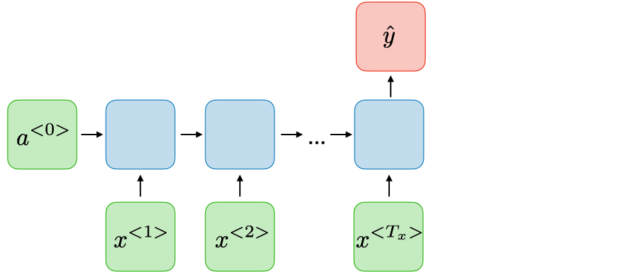

这个模型中，套了两层RNN。

```python
model = build_model()
```


### 批加载数据

这次数据集比较大，一共有$1559196$份数据，一般来说没有这么大内存将其所有的数据一次性全部转成one-hot形式。

因此，我们可以这样做：在训练的时候才开始加载数据，每一次只需要加载batch_size的数据，然后只需要将batch_size 大小的数据转成one-hot形式，然后进行训练。在这种情况下，只需要将batch-size的数据转成one-hot，可以大大减小内存消耗。

so，使用keras训练的时候，不能使用fit（因为fit需要一次将数据集全部放入RAM中），而应该使用[fit_generator](https://kldivergence.github.io/keras-docs-zh/models/model/#fit_generator)，关于其使用推荐看看：[Keras 如何使用fit和fit_generator](https://blog.csdn.net/zwqjoy/article/details/88356094)

```python
import math
def get_batch(batch_size = 32):
    """源源不断产生产生one-hot编码的训练数据

    :param batch_size: [一次产生训练数据的大小], defaults to 32
    :type batch_size: int, optional
    :yield: [返回X（np.array(X_train_batch)）和Y（np.array(Y_train_batch)）]
    :rtype: [X.shape为(batch_size, 6, 3000) , Y.shape数据的shape(batch_size, 3000)]
    """
    # 确定每轮有多少个batch
    steps = math.ceil(len(X_train_word) / batch_size)
    while True:
        for i in range(steps):
            X_train_batch = []
            Y_train_batch = []
            X_batch_datas = X_train_word[i*batch_size:(i+1)*batch_size]
            Y_batch_datas = Y_train_word[i*batch_size:(i+1)*batch_size]

            for x,y in zip(X_batch_datas,Y_batch_datas):
                X_train_batch.append(phrase_to_one_hot(x))
                Y_train_batch.append(word_to_one_hot(y))
            yield np.array(X_train_batch),np.array(Y_train_batch)
```


### 训练的过程中生成诗句

在训练的过程中，可以每经过一定数量的epoch生成一首诗，生成诗的操作如下：


在训练的过程中，调用`generate_sample_result`，即可产生五言诗，然后将生成的诗写入到`out/out.txt`中。

```python
def predict_next(x):
    """ 根据X预测下一个字符

    :param x: [输入数据]
    :type x: [x的shape为(1,TRAIN_NUM,WORD_NUM)]
    :return: [最大概率字符的索引，有可能为为2999，也就是预测的字符可能为“ ”]
    :rtype: [int]
    """
    predict_y = model.predict(x)[0]
    # 获得最大概率的索引
    index = np.argmax(predict_y)
    return index

def generate_sample_result(epoch, logs):
    """生成五言诗

    :param epoch: [目前模型训练的epoch]
    :type epoch: [int]
    :param logs: [模型训练日志]
    :type logs: [list]
    """
    # 每个epoch都产生输出
    if epoch % 1 == 0:
        # 根据“一朝春夏改，”生成诗
        predict_sen = "一朝春夏改，"
        predict_data = predict_sen
        # 生成的4句五言诗（4 * 6 = 24）
        while len(predict_sen) < 24:
            X_data = np.array(phrase_to_one_hot(predict_data)).reshape(1,TRAIN_NUM,WORD_NUM)
            # 根据6个字符预测下一个字符
            y = predict_next(X_data)
            predict_sen = predict_sen+ id_word_dict[y]
            # “寒随穷律变，” ——> “随穷律变，春”
            predict_data = predict_data[1:]+id_word_dict[y]
        # 将数据写入文件    
        with open('out/out.txt', 'a',encoding='utf-8') as f:
            f.write(write_data+'\n')
```

### 开始训练

在训练的时候，每隔一个epoch，都会将模型进行保存，每个epoch完成的时候，都会调用`generate_sample_result`生成诗。

```python
batch_size = 2048
model.fit_generator(
            generator=get_batch(batch_size),
            verbose=True,
            steps_per_epoch=math.ceil(len(X_train_word) / batch_size),
            epochs=1000000,
            callbacks=[
                ModelCheckpoint("poetry_model.hdf5",verbose=1,monitor='val_loss',period=1),
                # 每次完成一个epoch会调用generate_sample_result产生五言诗
                LambdaCallback(on_epoch_end=generate_sample_result)
            ]
    )
```

因为我的电脑就是一个mx250小水管，我就放在kaggle上面跑了，毕竟白嫖它不香吗？如果实在想自己跑，但是有没有比较好的GPU，可以尝试将`len(X_train_word)`改成其他的数，比如说“100000”。要在如下的两个地方改，这样的话，很快就可以出训练的结果。（这样会导致训练的时候无法覆盖整个数据集。）

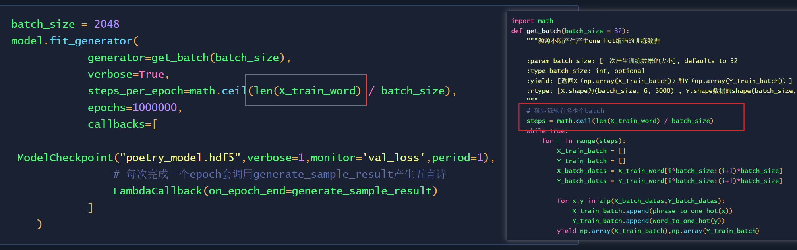


### 诗词生成

我在[Github](https://github.com/xiaohuiduan/rnn_chinese_poetry)中提供了训练好的[模型（注意keras版本是2.4.3）](https://github.com/xiaohuiduan/rnn_chinese_poetry/blob/main/poetry_model.hdf5)，在 **[test.ipynb](https://github.com/xiaohuiduan/rnn_chinese_poetry/blob/main/test.ipynb)** 中提供了如何加载模型然后生成诗句的方法，在这里就不赘述了。

最后简单的展示一下生成的结果（实际上模型训练的效果并不是很好，🤭）：

> 博客园牛逼，州心青山人。雨水不三在，花去不相河。


## 总结

在这篇博客中，详细介绍了如何使用keras模型构建一个RNN模型，然后使用其来自动生成五言诗。实际上，在个人看来，代码不是难题，最难的应该是思路，如果构建一个清晰明朗的思路，才是能够写好代码的前提。

项目地址：[Github](https://github.com/xiaohuiduan/rnn_chinese_poetry)

### 参考

1. [RNN模型与NLP应用(6/9)：Text Generation (自动文本生成)](https://www.youtube.com/watch?v=10cjvcrU_ZU&list=PLvOO0btloRnuTUGN4XqO85eKPeFSZsEqK&index=6&ab_channel=ShusenWang)
2. [Poems_generator_Keras](https://github.com/youyuge34/Poems_generator_Keras)
3. 深度学习框架PyTorch：入门与实践
4. [用Keras实现RNN+LSTM的模型自动编写古诗](https://www.ioiogoo.cn/2018/02/01/%E7%94%A8keras%E5%AE%9E%E7%8E%B0rnnlstm%E7%9A%84%E6%A8%A1%E5%9E%8B%E8%87%AA%E5%8A%A8%E7%BC%96%E5%86%99%E5%8F%A4%E8%AF%97/)
5. [Keras-SimpleRNN](https://kldivergence.github.io/keras-docs-zh/layers/recurrent/#simplernn)
6. [Keras-fit_generator](https://kldivergence.github.io/keras-docs-zh/models/model/#fit_generator)
7. [数据挖掘入门系列教程（十一）之keras入门使用以及构建DNN网络识别MNIST](https://www.cnblogs.com/xiaohuiduan/p/12806241.html)
8. [Keras 如何使用fit和fit_generator](https://blog.csdn.net/zwqjoy/article/details/88356094)

